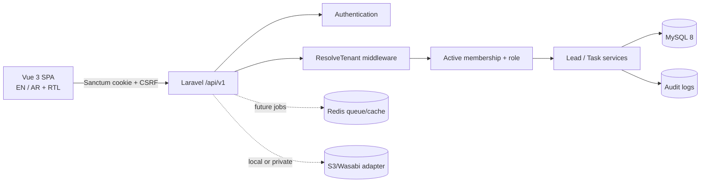

# Exousia Realty implementation plan

Updated: 2026-10-09

## Current status

| Milestone | Status | Verified scope |
| --- | --- | --- |
| Phase 0 — foundation | In progress | Laravel 12/Sanctum session auth, password reset and email verification, company memberships and workspace administration with email invitations/acceptance, tenant resolver, roles, audit log, Vue 3/TS/Vite UI shell, EN/AR direction, Docker/CI/docs |
| Phase 1 — lead CRM | In progress | Lead CRUD API (create/read/update/list), reversible lead archive/restore with tenant scope, role permission, timeline and audit history, scoped search/filter, Egyptian phone normalization, duplicate warning, tasks, activity timeline, real dashboard metrics, period-based lead/deal reports with prior-period comparisons and scoped CSV export, demo seed data |
| Phase 2 — inventory/matching | In progress | Tenant-scoped property listings, precise EGP piastre prices, private photos, role permissions, CRUD/search/filter UI, activity/audit history, fictional demo data, and tenant/permission/media tests; deterministic tenant-scoped lead-to-listing recommendations are implemented and covered by tenant/permission tests |
| Phase 3 — sales/commissions | In progress | Tenant-scoped deals link leads to optional listings and track negotiation status, agreed EGP value, expected close date, notes, activity history, and audit events; seller snapshots on won deals support period-based unit/value rankings. Tenant-scoped commission ledger supports exact percentage calculations or fixed amounts per deal/unit, employee self-visibility, management reports, status transitions, and audit history; private deal documents are also implemented |
| Phase 4 — SaaS commercialization | Not started | No subscription enforcement or billing is claimed |
| Phase 5 — integrations/hardening | Not started | No Meta, WhatsApp API, Paymob, or live external integration is claimed |

## Architecture

The application is a modular monolith. `ResolveTenant` selects only a company for which the user has an active membership; controllers then scope reads, writes, relationship validation, metrics, and duplicate checks to that company. Platform administration will use separate middleware and routes instead of bypassing tenant scope.

## Completed decisions

- Upgrade the installed Laravel 8 skeleton to the current PHP 8.2-compatible Laravel 12 line before building further modules.
- Same-origin Sanctum session authentication with CSRF protection rather than browser-stored API tokens.
- Database IDs are never treated as authorization. Company membership plus role permissions are required.
- Egyptian mobile numbers are canonicalized to `+20…`; the user-entered display value is retained.
- Duplicate numbers warn rather than block because multiple legitimate enquiries can share a contact.
- Later navigation is visibly marked as planned rather than backed by hardcoded fake data.

## Assumptions

- Initial currency is EGP and timezone is Africa/Cairo.
- A new user creates one brokerage and becomes its owner.
- Agents see leads they created or are assigned; management roles see the whole company.
- Manual calls, WhatsApp links, and notes are Phase 1; official messaging APIs require credentials and contract tests later.
- Current seed prices, people, companies, and listings are fictional development data.

## Immediate next tasks

1. Finish lead workflow improvements: bulk archive and bulk assignment are implemented for selected leads on the current page, with per-lead audit/history and tenant checks. Next add saved filters, XLSX import support, and full kanban drag/drop. CSV template, preview/import, row validation, and tenant-scoped exact-file idempotency are implemented; archive remains reversible, with permanent deletion intentionally not exposed.
2. Add granular policy classes for tenant resources. Password reset, general email verification, workspace invitations/acceptance, membership administration, and lead assignment history are implemented.
3. Add a PHP formatter and static analysis after the Laravel 12 compatibility pass.
4. Add Playwright tests when the browser runtime is available.

## Release gates

- All PHP tests, TypeScript checks, and frontend production build pass.
- A clean database can migrate and seed.
- Tenant A cannot read/write Tenant B data through IDs, filters, metrics, files, exports, or jobs.
- Production uses HTTPS, secure cookies, queue workers, backups, monitored cron, non-default credentials, and debug disabled.

## Verification log — 2026-10-09

- Reversible lead archive/restore: 22 PHP tests and 63 assertions passed, including role denial and cross-company restore isolation; TypeScript checks passed.
- Workspace team page and membership administration: owners/admins can add existing accounts, update roles, and deactivate/reactivate members; other roles can view the roster. Last active owner protection, tenant isolation, and audit history were tested.
- Lead assignment: owners/admins and managers can reassign from the visible Owner column; unauthorized roles cannot change assignments through the API. Assignment history is recorded in the lead timeline and audit log.
- Team invitations: the form collects a name, existing accounts are added directly, and new accounts receive a seven-day email invitation with a single-use acceptance link. Acceptance creates and verifies the account, activates the tenant membership, and sets the workspace. Tests cover invitation delivery/acceptance and audit records. `php artisan test`: 29 tests and 103 assertions pass; `npm.cmd run typecheck` and `nnpm.cmd run build` pass.
- Account recovery and verification: password reset links are single-use, reset and verification request responses do not disclose account existence, verification links are signed and expire after one hour, and unverified users cannot reach tenant APIs. Registration sends a verification email. `php artisan test`: 33 tests and 127 assertions pass; frontend typecheck and production build pass.
- Inventory vertical slice: tenant-scoped listing CRUD and filters, EGP piastre storage, status/price/photo history, audit events, private photo uploads and authorized reads, fictional seed listings, and a CKEditor 5 property description editor using the free GPL distribution. Listing locations are selected one at a time from the workspace location master and validated for tenant ownership and active status. The GPL distribution requires GPL compliance; use a commercial CKEditor license if this project cannot comply. `php artisan migrate:fresh --seed` on in-memory SQLite passes. `php artisan test`: 39 tests and 170 assertions pass; `npm.cmd run typecheck` and `nnpm.cmd run build` pass.
- Deals vertical slice: tenant-scoped sales pipeline linking a lead to an optional listing, with negotiation/reservation/contract/close status, expected close date, integer EGP agreed values, activity and audit history, role-based visibility, and fictional seed deals. Commission accounting and contract storage remain planned. `php artisan test`: 43 tests and 198 assertions pass; `npm.cmd run typecheck`, `nnpm.cmd run build`, and in-memory migrate/seed pass. Deal API tests cover role scope, tenant isolation, money precision, and history.
- Reports vertical slice: selectable month/quarter/year periods, tenant/member-scoped lead stage and source conversion, deal stage and agreed-value summaries, role permissions, and responsive UI. Lead conversion and deal wins use current pipeline/deal statuses; agreed deal amounts are not represented as collected cash. `php artisan test`: 46 tests and 218 assertions pass; TypeScript check, production build, and in-memory migration/seed pass. Report tests cover tenant isolation and permissions.

- `php artisan test`: 13 tests and 20 assertions passed, including cross-company lead/task isolation and agent visibility.
- `php artisan migrate:fresh --seed` with in-memory SQLite: passed.
- `npm run build`: Vue type-check and Vite 8 production build passed.
- `npm audit`: zero vulnerabilities.
- `composer audit`: zero security advisories after upgrading Laravel 8 to Laravel 12.69.
- Docker Compose syntax could not be executed locally because the Docker CLI is unavailable; files were reviewed but runtime verification remains outstanding.

- Lead/property matching, prior-period report comparisons and CSV export, and deal commissions/private documents: tenant-scoped API and UI slices added. php artisan test: 53 tests and 288 assertions pass; PHP syntax checks and 
npm.cmd run build pass. CSV, permission boundaries, matching filters, commission state transitions, private media access, and tenant isolation are covered.
- Lead acquisition source: confirmed the existing field is saved on leads and read by Reports. The lead form now explains it, and the list/detail screens show it; campaign attribution remains manual until integrations are added.
- Lead CSV import: downloadable template, preview with row validation and duplicate warnings, tenant-scoped all-or-nothing creation, and exact-file idempotency added. Import tests cover permissions, invalid batches, duplicate contacts, and company isolation. `php artisan test`: 53 tests and 288 assertions pass; `npm.cmd run build` passes.
- Sales performance reporting: won deals snapshot the assigned lead owner and close time; existing won deals are backfilled where a tenant membership can be resolved. Reports now show workspace employee leaders by units and recorded agreed value, export the same rows to CSV, and restrict agent reports to their own sales. Values are explicitly labeled as agreed deal values, not collected cash. Tests cover sorting, missing prices, close attribution, and tenant/member scope.
- Sales performance verification: `php artisan test` passes with 54 tests and 303 assertions; `npm.cmd run typecheck` and `npm.cmd run build` pass. The build retains the existing CKEditor chunk size warning.
- Bulk lead actions: current-page multi-select supports tenant-scoped assignment and reversible archive with per-lead history/audit events. Tests cover authorization and foreign-company IDs.
- Bulk lead action verification: `php artisan test` passes with 56 tests and 318 assertions; `npm.cmd run typecheck` and `npm.cmd run build` pass. The CKEditor bundle size warning remains.
- Commission calculation and reporting: commission entries now snapshot the linked property unit and the agreed-value base, calculate percentage amounts in integer EGP piastres or accept fixed amounts, and retain rate/base details for audit. Employees see only their own entries and report totals; management roles see workspace totals and employee breakdowns. Percentage calculation requires a linked unit, contracted or won status, and agreed sale value.
- Commission slice verification: `php artisan test` passes with 56 tests and 337 assertions; `npm.cmd run typecheck`, `npm.cmd run build`, and PHP syntax checks pass. Reports include itemized commissions by unit. The build retains the CKEditor chunk size warning.

